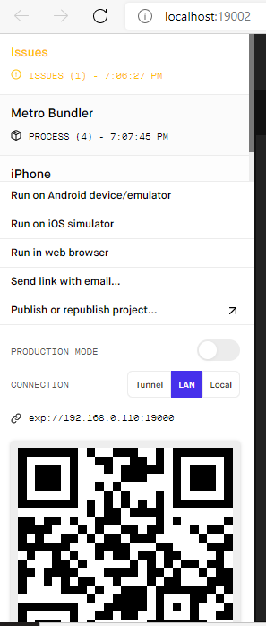

# rnuser
Projeto cadastro de usuário e listagem de produtos - (React Native).

- Clone do projeto:
```
$ git clone < https://github.com/NeiltonA/rnuser.git >
```

- Instalar as dependências do projeto:
```
$ npm install ou yarn install
```

- Start no projeto:
```
$ expo start, npm start ou npx start
```


- Prévia do projeto:

# Tela Inicial:


# Tela cadastro:


# Tela login:


# Tela listagem:


# Tela home:


