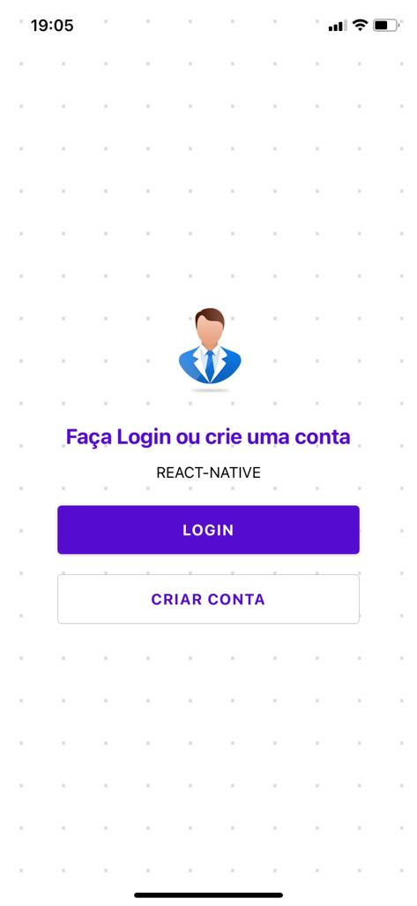
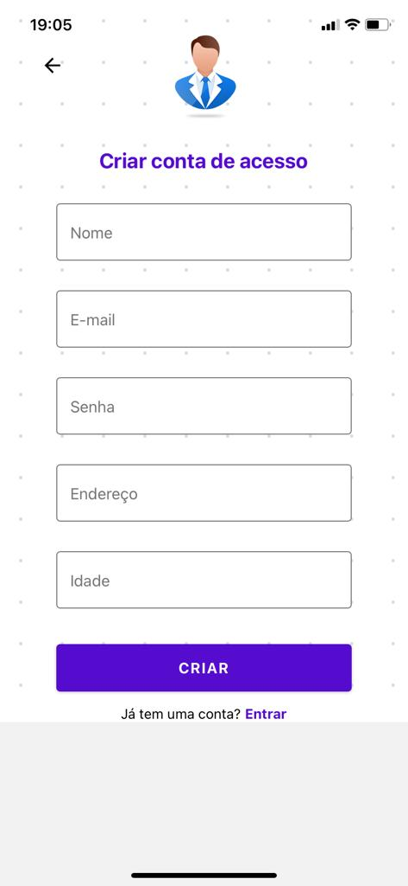
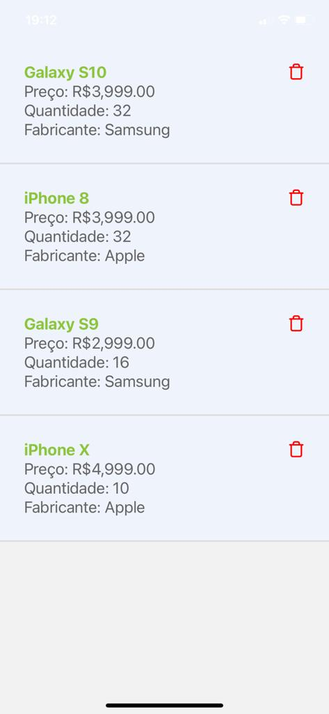
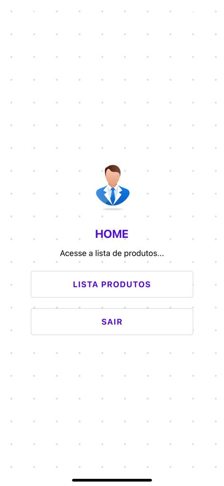

# rnuser
Projeto cadastro de usuário e listagem de produtos - (React Native).

- Clone do projeto
```
$ git clone < https://github.com/NeiltonA/rnuser.git >
```

```
$ npm install ou yarn install
```

```
$ expo start, npm start ou npx start
```

Tela Inicial:



Tela cadastro:




Tela login:


Tela listagem:




Tela home:




